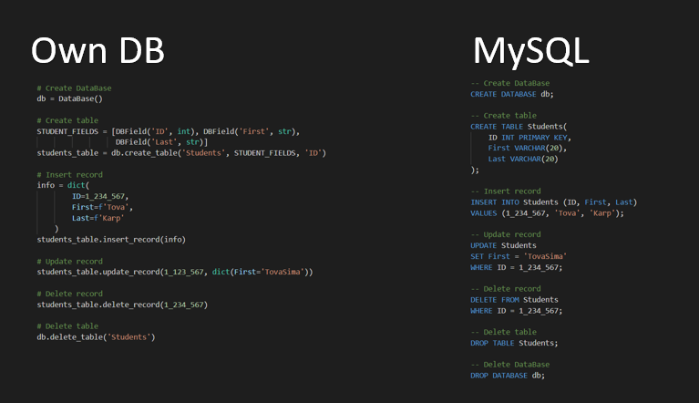

##### July 2020
# Database Project 

In this project we implemented a relational DataBase infrastructure.

The DB supports create and delete tables.
As well as, insert, delete, update and select records from/ to an existing table.

## Example
This very own DB syntax VS. MySQL syntax

## Team Members
* Tova Karp
* Chevi Glazer

## Libraries/Technologies Used
* Python 3.8
* Pytest 

## Special Thanks
* Ministry of Defence (8200 unit) mentors
* Our team 

